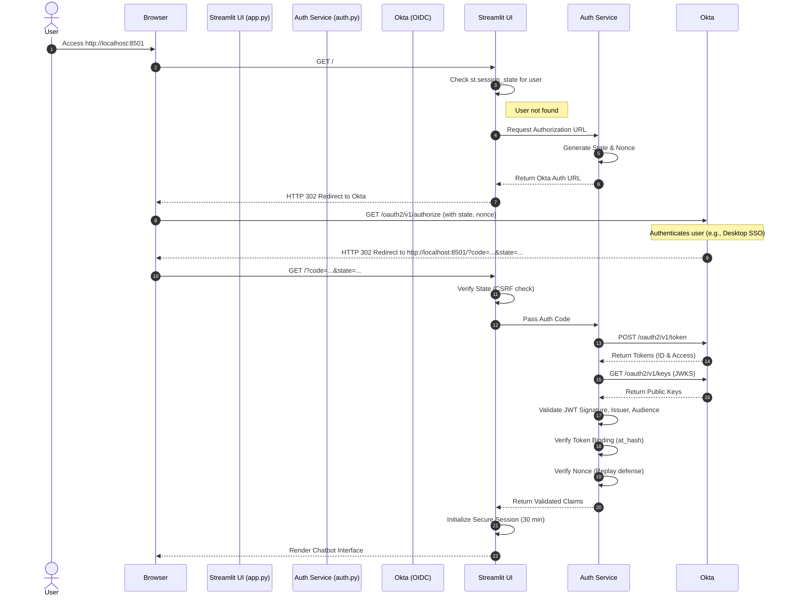

# Enterprise Data Assistant with Okta OAuth 2.0 Integration

A robust securely-authenticated Streamlit application demonstrating seamless integration with Okta for Enterprise Single Sign-On (SSO). Built for the modern enterprise, this chatbot validates users using their Windows Logon ID via Desktop SSO and handles session lifecycle management securely.

## 🌟 Key Features

*   **Seamless Okta Integration:** Authenticates users via Okta's OAuth 2.0 Authorization Code flow.
*   **Windows Logon ID Validation:** Designed to work perfectly with Okta Desktop SSO, automatically identifying users based on their Active Directory UPN or `samAccountName`.
*   **Strict Security Posture:**
    *   **CSRF Protection:** Generates a secure, random `state` parameter before redirecting to Okta. It gracefully handles Streamlit's tendency to drop session state during external redirects while strictly blocking invalid states if they do exist.
    *   **Replay Attack Prevention:** Implements a cryptographic `nonce` generated and sent to Okta, verifying it against the Okta claims in the returned ID token.
    *   **Strict JWT Signature Validation & Token Binding:** Instead of blindly trusting the token, the application dynamically fetches the Okta organization's JSON Web Key Set (JWKS) and cryptographically verifies the RS256 signature, the issuer URL, and the intended audience (Client ID). It additionally enforces cryptographic binding between the ID Token and the Access Token by validating the `at_hash` claim using `python-jose`.
*   **Intelligent Session Management:** Enforces a hard 30-minute session expiration, automatically invalidating the session and redirecting the user to Okta to terminate the SSO session centrally.

## 🛠️ Architecture and Implementation Details

### Authentication Flow Diagram



The application is split into two primary components to maintain clean architecture and security:

1.  **`auth.py` (The Security Layer):** 
    Handles all interactions with the Okta Authorization Server.
    *   Generates secure login URLs with dynamic `state` and `nonce` parameters.
    *   Exchanges authorization codes for identity and access tokens securely via backend HTTP requests (`httpx`).
    *   Performs rigorous cryptographic validation of the JWT using the `python-jose` library and Okta's public JWKS. This includes verifying the signature, issuer, audience, nonce, and `at_hash` (access token binding).
    *   Generates accurate logout URLs to terminate the session at the Identity Provider level.

2.  **`app.py` (The Presentation Layer):** 
    The Streamlit UI that the user interacts with.
    *   Maintains secure session state `st.session_state` to store user identity and temporarily hold cryptographic parameters (`oauth_state`, `oauth_nonce`).
    *   Dynamically handles the OAuth callback by parsing the URL, extracting the tokens, and clearing query parameters to prevent duplicate submissions.
    *   Implements an auto-redirect mechanism for unauthenticated users.
    *   Renders a conversational UI ("Enterprise Data Assistant") using Streamlit's new `st.chat_message` components.

## 🚀 Getting Started

### Prerequisites

*   Python 3.9+
*   An Okta Developer Account (or Enterprise Tenant)
*   An Okta OIDC Application configured as a "Web App" with:
    *   Grant type: Authorization Code
    *   Sign-in redirect URI: `http://localhost:8501/`
    *   Sign-out redirect URI: `http://localhost:8501/`

### Installation

1.  **Clone the repository and install dependencies:**
    ```bash
    pip install -r requirements.txt
    ```

2.  **Configure Environment Variables:**
    Create a `.env` file in the root directory and populate it with your Okta application credentials:
    ```env
    OKTA_DOMAIN=https://dev-xxxxxx.okta.com
    OKTA_CLIENT_ID=your_client_id_here
    OKTA_CLIENT_SECRET=your_client_secret_here
    REDIRECT_URI=http://localhost:8501/
    ```

3.  **Run the application:**
    ```bash
    streamlit run app.py
    ```

## 🔒 Security Considerations

This application is built with security first. It does not rely on implicit flows or front-channel token delivery. All token exchanges and cryptographic validations happen securely on the backend, ensuring that tokens cannot be easily intercepted or tampered with by an end-user.

---
*Built to demonstrate secure, enterprise-grade AI applications using Streamlit and Okta.*
